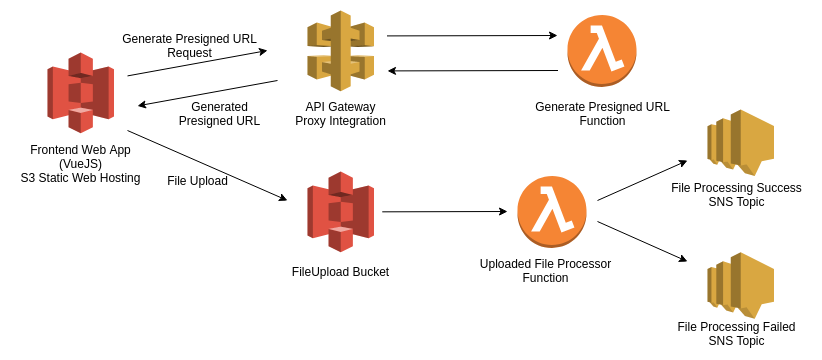

# Upload files to s3 with presigend URLs with AWS SAM

This project is to create a presigned url to upload files to s3 directory. Whole stack will be created using AWS SAM.

Architecture is as follows:



## Prerequisites

* Need to have sam cli and npm installed


## How to install

1. Within the backend directory, run:
```
sam build
sam deploy -g
```
- Parameter *SnsNotificationEmail* : Add an email address to recieve SNS notification from uploaded file processed events

2. This will create:
- S3 bucket for static web site hosting
- S3 bucket to upload files
- Lambda function to generate pre-signed url
- API gateway to trigger above lambda
- Lambda function to trigger when file is uploaded into the S3 bucket
- Lambda destination SNS topic for above function when success
- Lambda destination SNS topic for above function when failed

** While creating the stack, you will receive two emails to subscribe to above sns topics. Confirm the subscriptions.

Once the stack is created, note the values of below outputs:

* `S3WebsiteURL` - This will be the final url to access the system.
* `S3WebsiteBucket` - S3 bucket for static website contents.
* `S3FileUploadBucket` - S3 bucket to store the uploaded files
* `PresignedUrlApi` - API endpoint to generate the presigned url.

3. Go to the frontend directory.
Update the variable `VUE_APP_GENERATE_URL` in the .env file with the value of `PresignedUrlApi`.

4. Run below commands to install dependancies and build the frontend
```
npm install
npm run build
```

This will generate the project files to deploy in the `dist` directory.

5. To copy the built contents to s3, run:
```
aws s3 cp dist s3://<S3WebsiteBucket> --recursive
```

6. Access the web site using the `S3WebsiteURL` value.

7. Upload a file and you should receive a sns notification to the given email.


## Deleting the stack

1. First remove the data in the both s3 buckets:

```
aws s3 rm s3://<S3FileUploadBucket> --recursive
aws s3 rm s3://<S3WebsiteBucket>  --recursive
```

2. Then run:

```aws cloudformation delete-stack --stack-name <Stack Name>```